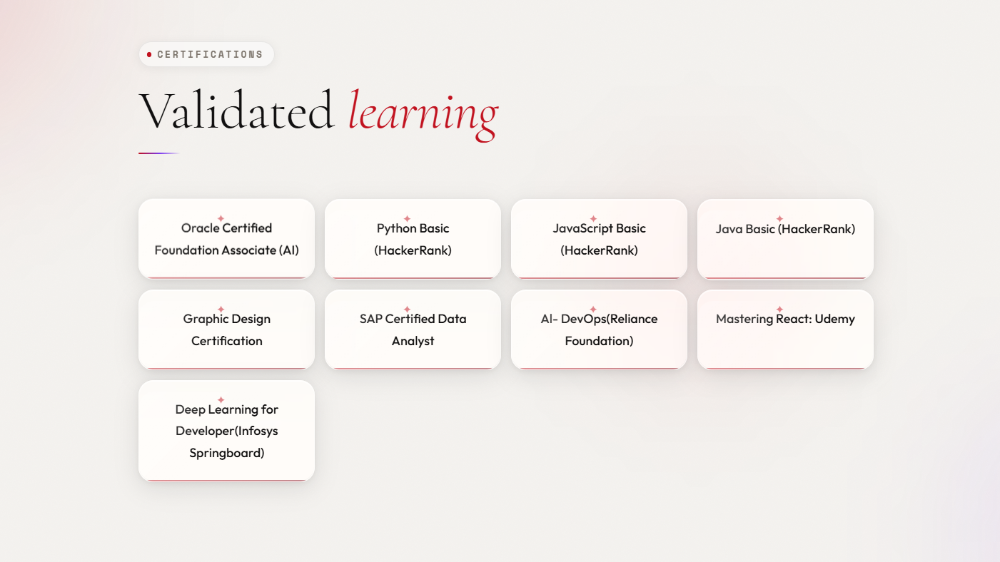
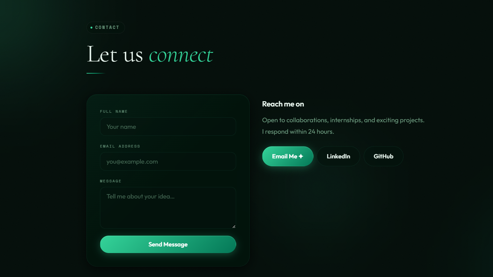
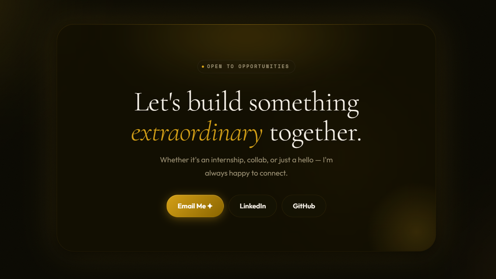
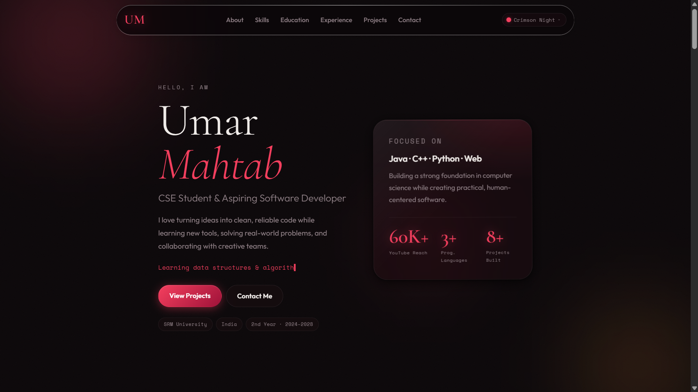

# Umar Mahtab

A modern, single-page portfolio website for me. The site is built as a self-contained HTML page with a premium glassmorphism look, theme switching, animated sections, and contact links for sharing work or connecting with recruiters.

## Live
- https://umarmahtab.vercel.app

## Preview

<table>
<tr>
<td align="center">

</td>

<td align="center">

</td>
</tr>

<tr>
<td align="center">

</td>

<td align="center">

</td>
</tr>
</table>

## Features

- Responsive single-page layout
- Theme switcher with multiple visual styles
- Smooth scroll and animated reveal effects
- Typing text animation in the hero section
- Glass-style cards, ambient orbs, and polished UI details
- Mobile-friendly navigation menu
- Contact form with a send-state interaction
- Social and email links for quick outreach

## Project Files

- `Portfoliov4.html` - Main portfolio page
- `README.md` - Project overview and usage notes
- `images/` - Image assets used in the portfolio
- `images/projects/` - Project preview images

## How To Run

This is a static HTML project, so you can open `Portfoliov4.html` directly in any browser.

For a smoother editing experience, open the folder in VS Code and launch the page with Live Server or another local preview tool.

## Tech Stack

- HTML5
- CSS3
- JavaScript
- Google Fonts

## Notes

- The project is intentionally kept in one HTML file for easy sharing and deployment.
- If you add new assets, keep them inside the `images/` folder and update the corresponding paths in the HTML.
